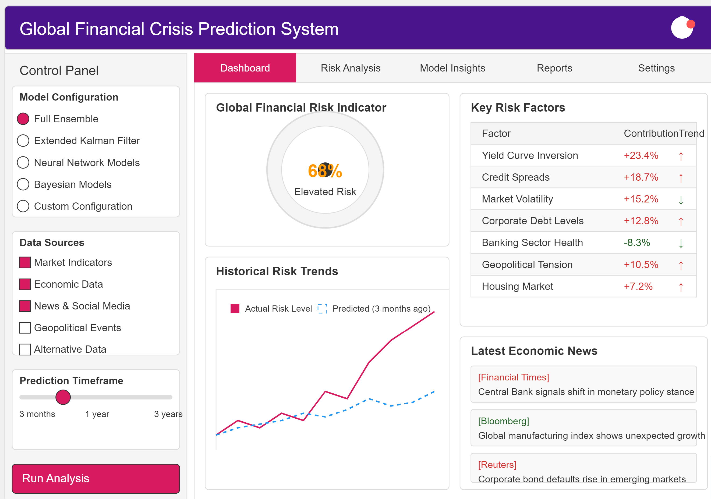
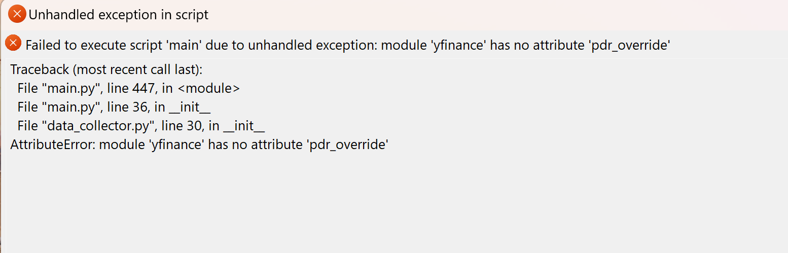
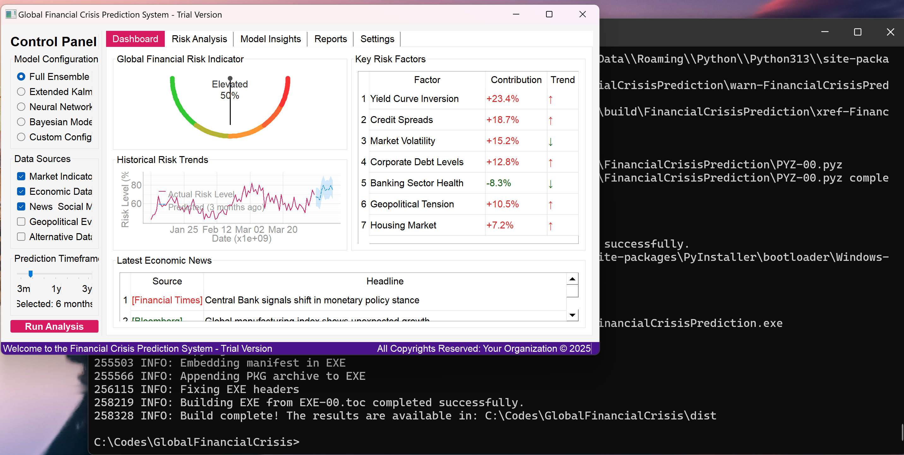
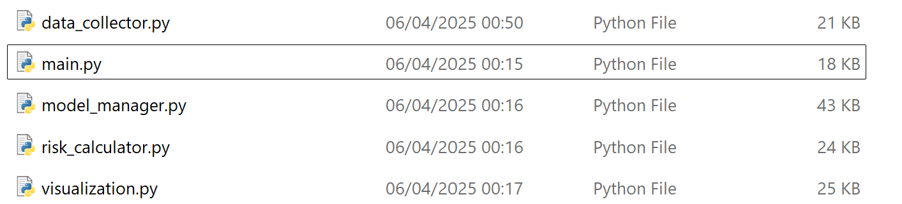

# Global Financial Crisis Prediction System

A hybrid ML system for predicting financial crises using Extended Kalman Filtering, LSTM neural networks, ensemble machine learning, and Bayesian uncertainty quantification.

## Screenshots

<p align="center">
  &nbsp;&nbsp;
</p>
<p align="center">
  &nbsp;&nbsp;
</p>

## Architecture

```
├── main.py              # Application entry point & PyQt5 GUI
├── data_collector.py    # Multi-source data acquisition (Yahoo Finance, FRED, RSS)
├── model_manager.py     # ML model ensemble management
├── risk_calculator.py   # Risk scoring & early warning engine
├── visualization.py     # Chart and gauge generation
└── requirements.txt
```

## Models

- **Extended Kalman Filter** — Tracks dynamic financial states with noise management
- **Random Forest & Gradient Boosting** — Pattern recognition on macro indicators
- **LSTM Neural Networks** — Long-term dependency capture in time series
- **Bayesian Framework** — Uncertainty quantification and expert knowledge integration
- **Anomaly Detection** — Multi-indicator outlier identification

## Key Risk Indicators Tracked

Yield curve inversions, market volatility (VIX), credit spreads, unemployment, inflation, housing market, debt levels, financial stress indices, news sentiment, and geopolitical events.

## Data Sources

- **Yahoo Finance** — Market data
- **FRED** — Federal Reserve economic indicators
- **RSS Feeds** — Financial news sentiment
- **FREDAPI** — Programmatic access to economic time series

## Requirements

```
pip install -r requirements.txt
```

Key dependencies: PyQt5, PyTorch, scikit-learn, pandas, yfinance, fredapi, filterpy, nltk, pyqtgraph

## Usage

```bash
python main.py
```

Select models, choose data sources, set prediction timeframe, and click "Run Analysis."

## Author

**Dr. Mosab Hawarey** — [github.com/mhawarey](https://github.com/mhawarey)

## License

MIT License

## Disclaimer

For educational and research purposes only. Not financial advice.
